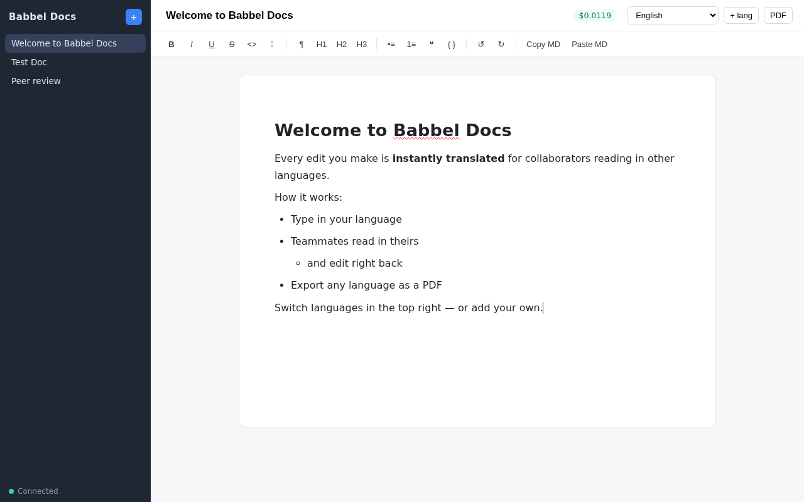
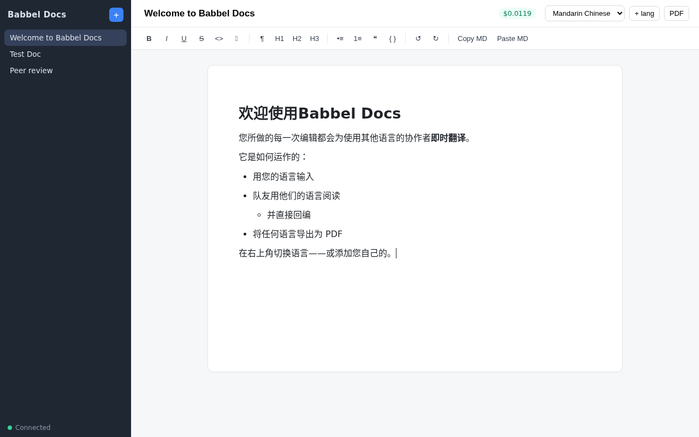

# Babbel Docs

A collaborative rich-text editor with real-time translation. Everyone edits
the same document in their own language; edited sentences are automatically
retranslated into the document's other languages with Claude.

**Frontend-only.** There is no server: a Google Doc is the database, and the
app is a static page (host it on GitHub Pages). All Google API calls happen in
the browser with the signed-in user's own OAuth token.

| English view | Same document in Chinese |
|---|---|
|  |  |

## How it works

- **The Google Doc is the storage — with no duplicated content.** One tab per
  language holds the rendered, human-readable document; a small `babel:meta`
  tab holds only config (languages, the Anthropic API key, cost counters).
- **Sentences are the unit of sync.** Paragraphs carry structure (headings,
  bullets, nesting) via `babelp:` named ranges; every sentence has its own
  invisible `babel:<id>:<ownHash>:<srcHash>` range. Hash mismatches detect
  outside edits (reconciled and retranslated); a translation whose `srcHash`
  no longer matches its source sentence is stale. Two people editing
  different sentences of the same paragraph — same language or different
  languages — merge cleanly; only same-sentence conflicts are last-write-wins.
- **Sentence-level translation**: only the sentences you actually edited are
  retranslated (Claude Sonnet, called straight from the browser) — the
  surrounding paragraph and neighboring blocks ride along as context.
- **Coordination via invisible Drive `appProperties`**: while a client
  translates a block it holds a `lock_<id>` app property on the file; other
  clients back off and highlight the block. Locks are invisible to users
  (nothing in the doc, no comments), expire after 2 minutes, and propagate
  with the regular 500ms metadata poll.
- **Sync** is polling: clients poll Drive file metadata (~2×/s, cheap; also
  carries the locks) plus the Docs `revisionId` (1/s) and refetch the doc
  only when content actually changed.

## Using it

1. Open the app and sign in with Google.
2. Paste the URL of any Google Doc you can edit (or follow a shared link like
   `…/?doc=DOC_ID&lang=pl`, which opens that document in that language).
3. First time per document, the app walks you through setup: pick the language
   of the existing content and paste an Anthropic API key.
   **The key is stored inside the doc's `babel:meta` tab — anyone with read
   access to the document can see and use it.** Use a key with a spend limit
   and only share the doc with people you trust.
4. Add languages with **+ lang** — a new tab is created and the whole document
   is translated into it. Switch languages with the dropdown; edit in any of
   them. The live Claude spend for the document shows in the top bar.
5. **Share** copies a link that opens the doc in the current language (the
   recipient signs in with their own Google account and needs access to the
   doc itself). PDF export: use Google Docs (File → Download) on the language
   tab you want.

## Hosting / setup (one-time, for the person deploying)

The app is static — any static host works; GitHub Pages instructions:

1. Repo → Settings → Pages → deploy from branch `main`, root (`/`).
2. Google Cloud Console (reusing an existing OAuth project is fine):
   - Enable the **Google Docs API** and the **Google Drive API**.
   - OAuth consent screen: add the scopes `…/auth/documents` and `…/auth/drive`.
     For an External/unverified app, users see a "Google hasn't verified this
     app" warning they click through once.
   - Credentials → the OAuth 2.0 **Web application** Client ID: add the GitHub
     Pages origin (e.g. `https://<user>.github.io`) to Authorized JavaScript
     origins.
   - Put the Client ID in `static/gdocs.js` (`CLIENT_ID`).

No build step; `static/vendor/prosemirror.js` is a committed ESM bundle.

## Keyboard shortcuts

| Keys | Action |
|---|---|
| Ctrl+B / Ctrl+I / Ctrl+U | Bold / italic / underline |
| Tab / Shift+Tab (in a list) | Indent / outdent list item |
| Ctrl+] / Ctrl+[ | Same, where Tab is awkward |
| Enter (in a list) | New list item |
| Ctrl+Z / Ctrl+Y | Undo / redo |
| `# `, `## `, `- `, `1. `, `> `, ``` ``` ``` | Heading / list / quote / code block as you type |

Plus **Copy MD** / **Paste MD** toolbar buttons for Markdown in and out.

## Document model

A document is a flat list of blocks (`paragraph | heading | list_item |
blockquote | code`), each with a stable id and per-language inline-HTML
content. In the Google Doc, one block = one paragraph; headings map to Docs
heading styles, lists to real Docs bullets (nesting included), blockquotes to
indented paragraphs, code blocks to shaded Courier paragraphs, and `<br>` to
soft line breaks. When a block is edited, the app diffs its sentences against
the previous source text and sends only the changed sentences to Claude, with
the paragraph and the existing translation as context, so formatting and the
untouched sentences survive.

The previous self-hosted client/server version (FastAPI + WebSockets +
WeasyPrint PDF export) lives on the [`hosted-server`](../../tree/hosted-server)
branch.
